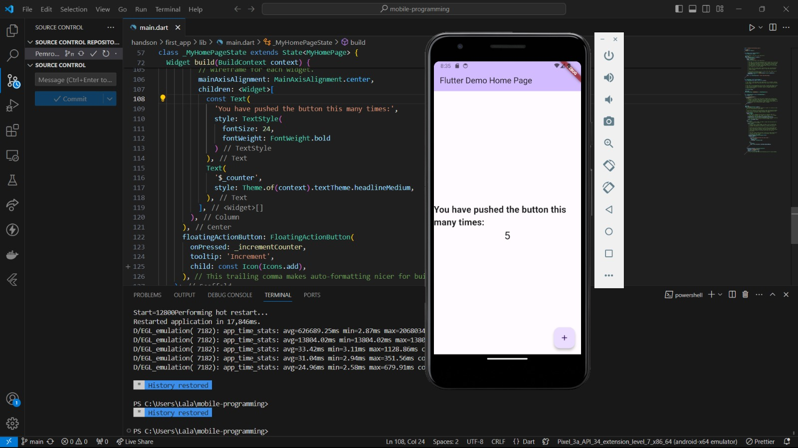
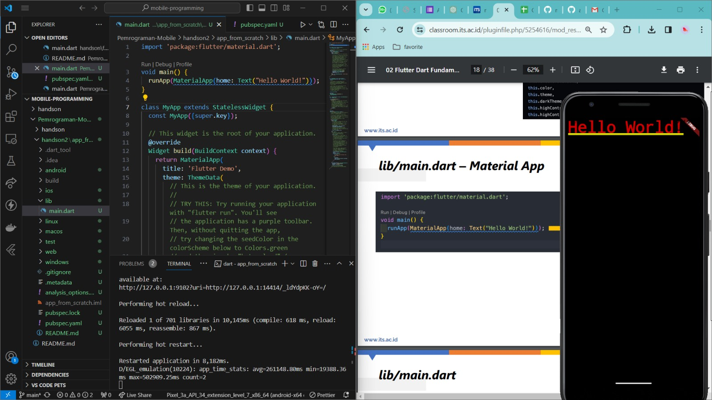
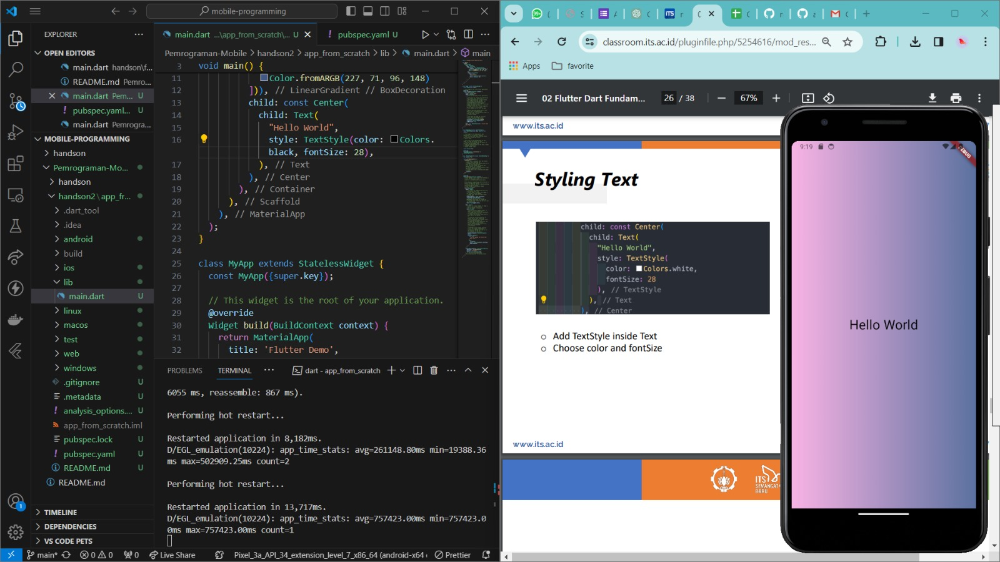
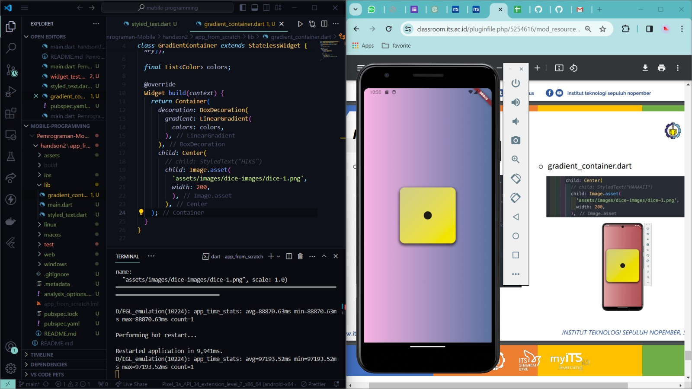
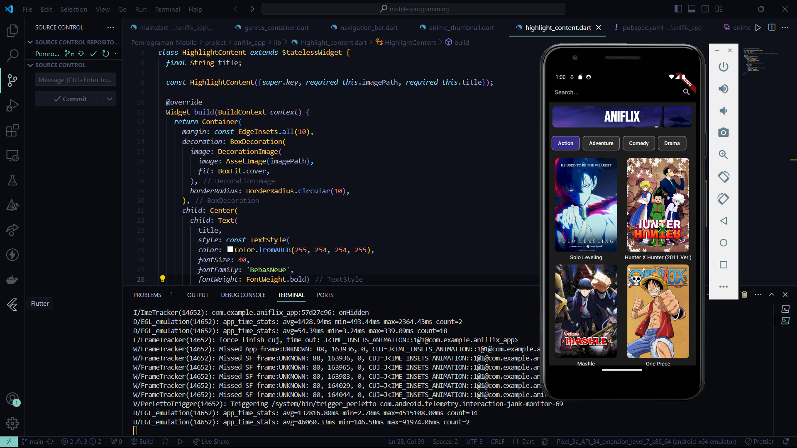
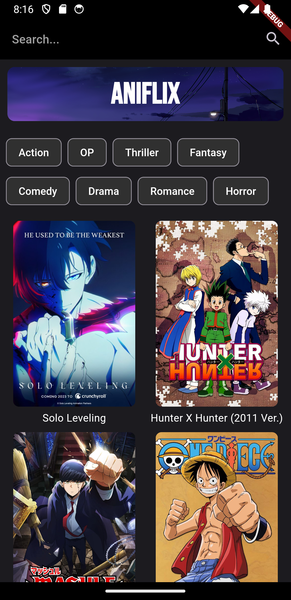
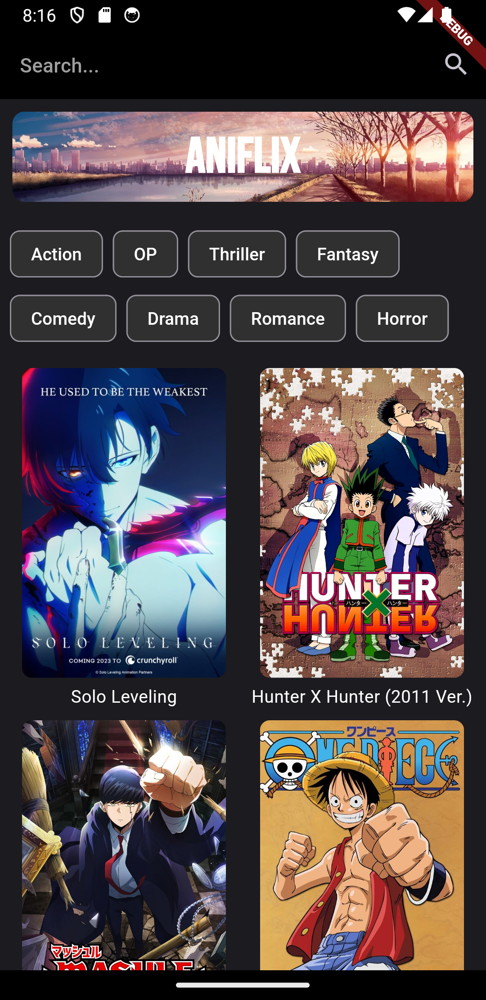
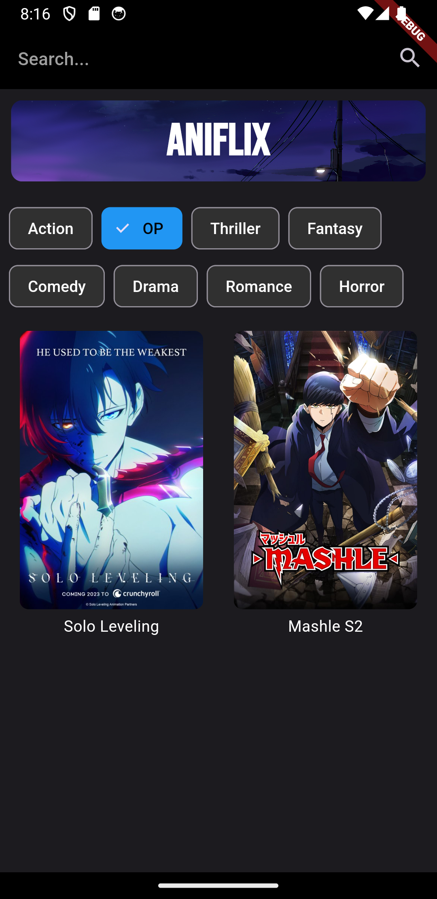
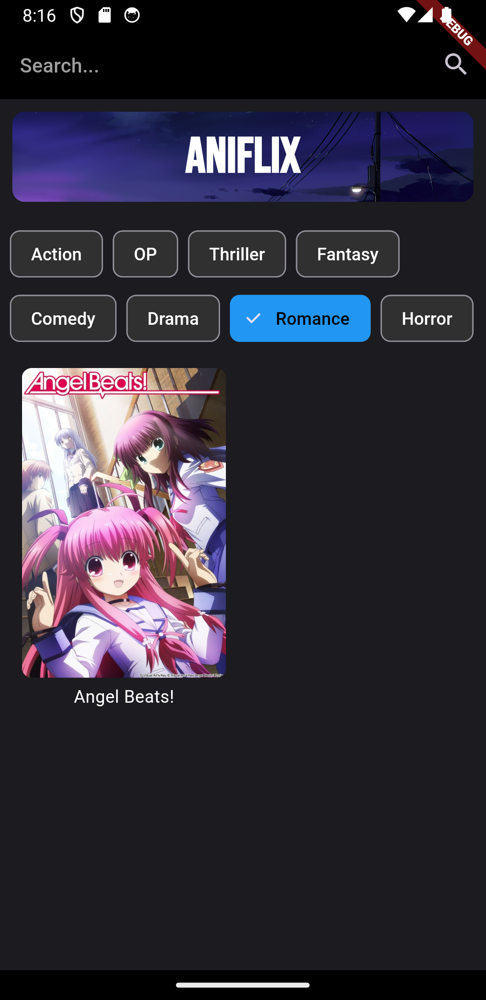

# Pemrograman-Mobile

## Tampilan Hands-on first app text style, 21 Maret 2024

## Tampilan Hands-on app from scratch, 21 Maret 2024
### Run MaterialApp

### Styling Text

### Display Image

## Tampilan Progress App Project
### Landing Page - Aniflix

### Landing Page - Aniflix 30 Maret 2024

### Text Button (ANIFLIX -> merubah image background)

### Genres as Stateful Widget

