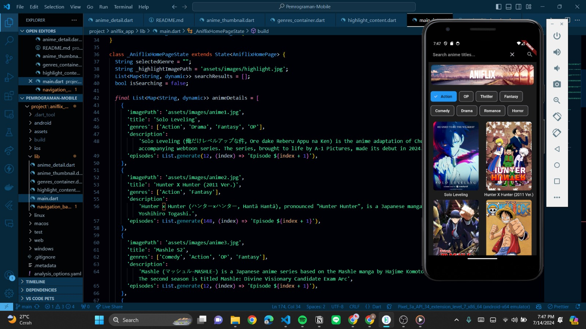
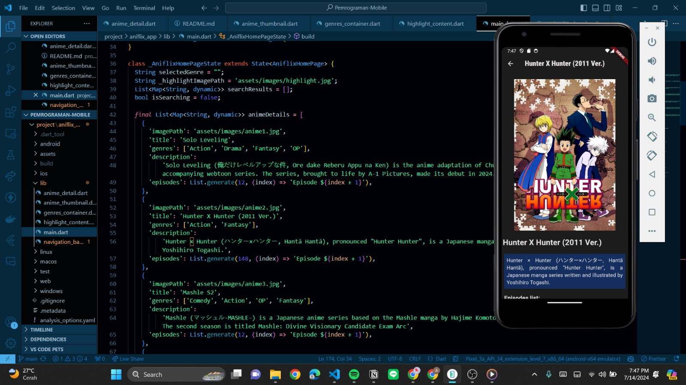

# aniflix_app

## Kriteria final project selain Originality & Demo
1. Widgets (Use various Widget - Done)
-> navbar, header, genre, thumbnail, dan detail.

2. State Management
- Use StatefulWidget and State classes to manage and update state variables (Done) -> genres_container.
- Implement setState method to update state variables in response to user actions (Done) -> genres_container; ketika diklik akan mendisplay thumbnail sesuai genre.
- Demonstrate UI components that dynamically update based on state changes managed by setState (Done) -> bisa dilihat pada video demo singkat.

3. Handle Data & Form Validation
- Use various widgets form like TextField or TextFormField to capture user input (Done) -> searchbar/navigation_bar.
- Implement validators to validate user input against specific criteria (Done) -> ketika null, akan memunculkan feedback & ketika yang disearch tidak ada maka akan memunculkan "no results".
- Provide clear feedback messages, such as error and success notification -> ketika search null, akan muncul pesan notifikasi "please enter search term".

4. Backend (Not Done)
- Plan awal: membuat comment section yang dikoneksikan ke firebase. (error)

### Link video demo
https://drive.google.com/drive/folders/1_kGEhkOzO46SgmJufKOYWVQnXDhvoWDY?usp=drive_link
